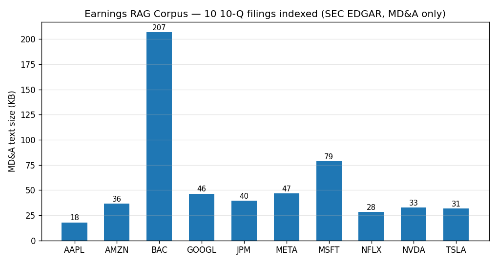

# M4 Earnings RAG

Conversational Q&A over US public-company **10-Q MD&A** sections, powered by a
**100% local stack** — no API keys, no cloud LLMs.

- **LLM:** Ollama (`qwen2.5:7b`) at `http://localhost:11434`
- **Embeddings:** `sentence-transformers/all-MiniLM-L6-v2`
- **Vector store:** ChromaDB (local persistence at `data/chroma/`)
- **Frontend:** Streamlit chat UI with collapsible citations
- **Source data:** SEC EDGAR 10-Q filings (free, public)

Tickers covered: AAPL, MSFT, GOOGL, AMZN, JPM, BAC, NVDA, TSLA, META, NFLX.

## Demo



```text
$ python scripts/run_demo.py
Q: What does Microsoft say about Azure or cloud growth in its latest MD&A?

A: Microsoft reports that Azure and other cloud services revenue grew 40%,
   driven by demand for services across the platform with continued growth
   across all workloads [1, 3]. This growth is a key driver of overall
   Intelligent Cloud segment revenue increases [1].

Sources:
  [1] MSFT 10-Q filed 2026-04-29 - Item 2 MD&A, paragraph 270
  [3] MSFT 10-Q filed 2026-04-29 - Item 2 MD&A, paragraph 100
```

Full output: [`docs/cli-demo.txt`](docs/cli-demo.txt) | More Q&As: [`docs/sample-qa.md`](docs/sample-qa.md)

---

## Resume framing

Equity-research / asset-management signal: build a RAG bot that does
ground-truth Q&A over actual SEC disclosures with explicit per-paragraph
citations. Solves the "where did this number come from?" problem that kills
LLM trust in finance workflows.

## Quickstart

```bash
# 0. Prereqs: Python 3.12+, Ollama running with qwen2.5:7b pulled.
ollama serve &
ollama pull qwen2.5:7b

# 1. Install
python3.12 -m venv .venv && source .venv/bin/activate
pip install -e ".[dev]"

# 2. Build index (fetches ~20 10-Qs from SEC EDGAR, ~2-5 min)
python scripts/build_index.py

# 3. Run UI
streamlit run app.py

# OR run terminal demo
python scripts/run_demo.py
```

## Architecture

```
SEC EDGAR 10-Q HTML
        |
        v   transcripts.py  (polite UA, 0.15s rate-limit, MD&A regex slice)
data/transcripts/*.txt
        |
        v   index.py  (chunk 500-tok / 50-overlap, MiniLM embed)
data/chroma/  (PersistentClient, cosine HNSW)
        |
        v   rag.py  (top-5 retrieve, format with [n] citations)
        v   Ollama qwen2.5:7b (temp=0.2, seed=42)
        |
        v   app.py (Streamlit chat) | scripts/run_demo.py
```

## Files

| Path | Role |
|---|---|
| `src/m4_earnings_rag/config.py` | Paths, tickers, CIKs, models, knobs |
| `src/m4_earnings_rag/transcripts.py` | SEC EDGAR fetch + MD&A extraction |
| `src/m4_earnings_rag/index.py` | Chunk + embed + Chroma index/query |
| `src/m4_earnings_rag/rag.py` | RAG: retrieve + Ollama + citations |
| `app.py` | Streamlit chat UI |
| `scripts/build_index.py` | One-shot pipeline |
| `scripts/run_demo.py` | 5 sample Q&As |
| `tests/test_smoke.py` | 9 offline tests |

Each ≤300 lines as required.

## Graceful failure modes

- **Ollama down at runtime:** `rag.answer()` still returns retrieved citations
  with a clear error string. UI shows red status in sidebar with restart hint.
- **Index not built:** `app.py` shows "Indexed chunks: 0" and the answer
  function returns a helpful "run build_index.py" message.
- **SEC rate-limit / network failure:** fetch is retried per-ticker; partial
  successes are kept; failures logged but don't abort the run.

## See also

- `docs/sample-qa.md` — three example Q&As with citations.
- `STATE.md` — implementation snapshot + known limitations.

## Author

Yash Patel | Tempe, AZ | yashpatel06050@gmail.com
LinkedIn: linkedin.com/in/yash-patel-67449029b
GitHub: github.com/ypatel39-commits
